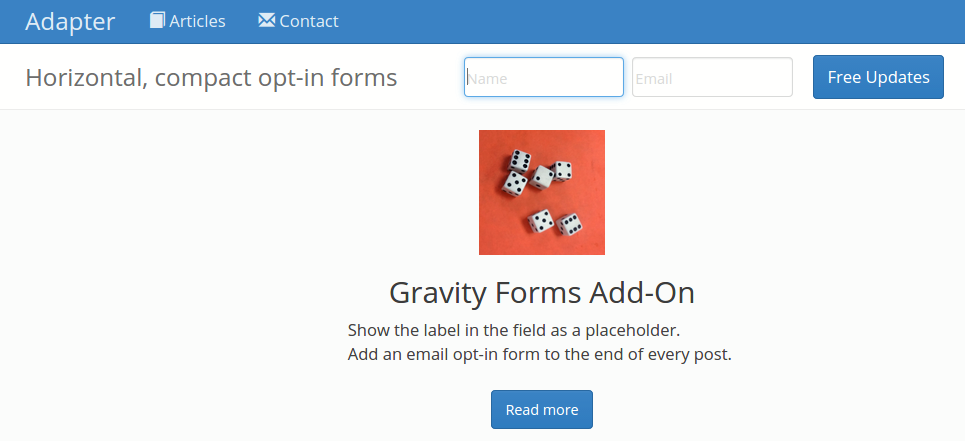
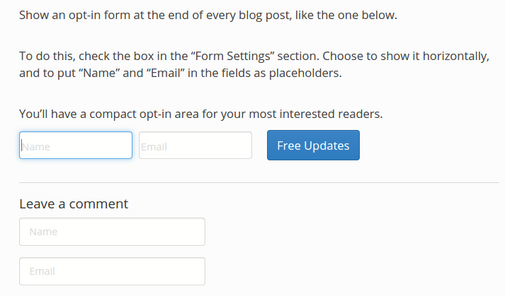
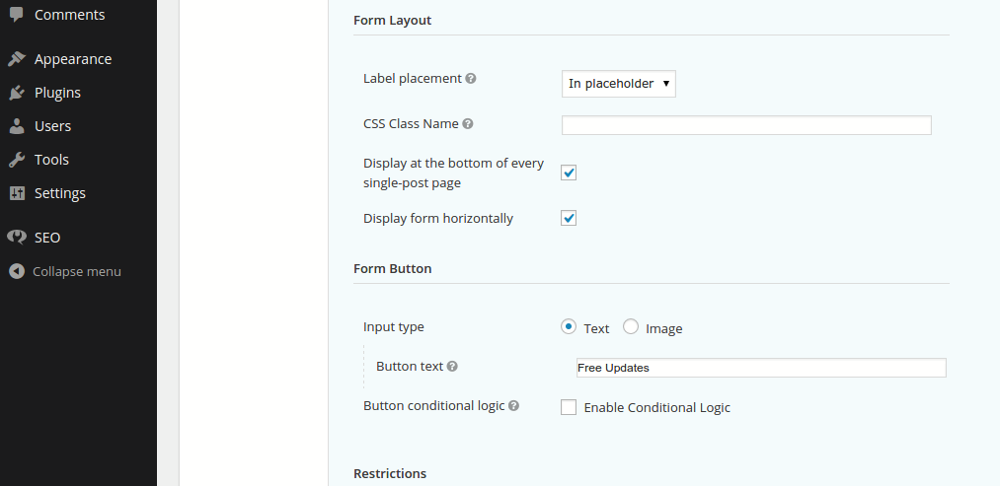

<!-- DO NOT EDIT THIS FILE; it is auto-generated from readme.txt -->
# Adapter Gravity Add-On

Easy email opt-ins with Gravity Forms. Display them horizontally, at the end of every post.

**Contributors:** [ryankienstra](https://profiles.wordpress.org/ryankienstra)  
**Tags:** [forms](https://wordpress.org/plugins/tags/forms), [styling](https://wordpress.org/plugins/tags/styling), [gravity](https://wordpress.org/plugins/tags/gravity)  
**Requires at least:** 3.8  
**Tested up to:** 4.9-alpha  
**Stable tag:** 1.0.3
**License:** [GPLv2 or later](http://www.gnu.org/licenses/gpl-2.0.html)  
**Donate link:** http://jdrf.org/get-involved/ways-to-donate/  

## Description ##

* Makes email opt-in forms horizontal, and small enough to put anywhere.
* Set an opt-in form to show at the end of every post.
* Must have the Gravity Forms plugin.
* Show the labels as placeholders. This makes the form smaller and more mobile-friendly.

## Installation ##

1. Ensure that you've installed and activated Gravity Forms.
1. Upload the adapter-gravity-add-on directory to your /wp-content/plugins directory.
1. In the "Plugins" menu, find "Adapter Gravity Add On," and click "Activate."
1. In the left of your Admin screen, click "Forms."
1. Scroll over one of your forms, and click "Form Settings."
1. Scroll down to "Form Layout."
1. You'll see options to "Display at the bottom of every single-post page" and "Display form horizontally."
1. Select one or both of these.
1. If you selected "Display form horizontally," follow the setup video below.

## Frequently Asked Questions ##

### What does this require? ###
Gravity Forms 1.9 or higher. This is tested up to Gravity Forms 2.2.5.

## Screenshots ##

### A horizontal email opt-in form.

### Automatically show an opt-in form at the end of every blog post.

### Settings for this plugin. Find these by clicking "Forms" in the left menu of your admin screen. Scroll over one of your forms, and click "Form Settings." Scroll down to "Form Layout."

## Changelog ##

### 1.0.2 ###
* Improved compatibility with Gravity Forms version 1.9 and above. Removes support for placeholders, as Gravity Forms now supports them. And fixing styling issues for horizontal forms.

### 1.0.1 ###
* Security improvements.

### 1.0.0 ###
* First version

## Upgrade Notice ##

### 1.0.2 ###
Please upgrade if you have Gravity Forms 1.9 or above. If you've used this to display a form horizontally or output a placeholder, please follow the instructions in this [setup video](https://youtu.be/xPHsKf5rUNg).

### 1.0.1 ###
Please upgrade for the security improvements.

