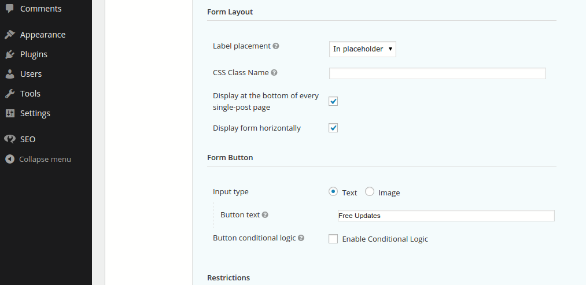

<!-- DO NOT EDIT THIS FILE; it is auto-generated from readme.txt -->
# Adapter Gravity Add-On

Display your Gravity Form at the end of every post. Also choose to show it horizontally, and with placeholders instead of labels.

**Contributors:** [ryankienstra](https://profiles.wordpress.org/ryankienstra)  
**Tags:** [forms](https://wordpress.org/plugins/tags/forms), [styling](https://wordpress.org/plugins/tags/styling), [gravity ](https://wordpress.org/plugins/tags/gravity )  
**Requires at least:** 3.8  
**Tested up to:** 4.3.1  
**Stable tag:** 1.0.1  
**License:** [GPLv2 or later](http://www.gnu.org/licenses/gpl-2.0.html)  
**Donate link:** http://jdrf.org/get-involved/ways-to-donate/  

## Description ##

* Makes email opt-in forms horizontal, and small enough to put anywhere.
* Set an opt-in form to show at the end of every post.
* Must have the Gravity Forms plugin.
* Show the labels as placeholders. This makes the form smaller and more mobile-friendly.

## Installation ##

1. Upload the adapter-gravity-add-on directory to your /wp-content/plugins directory.
1. In the "Plugins" menu, find "Adapter Gravity Add On," and click "Activate."
1. In the left of your Admin screen, click "Forms."
1. Scroll over one of your forms, and click "Form Settings."
1. Scroll down to "Form Layout."
1. You'll see a new option for "Label placement": "In placeholder."  You'll also see options to "Display at the bottom of every single-post page" and "Display form horizontally."

## Frequently Asked Questions ##

### What does this require? ###
Gravity Forms 1.8.

## Screenshots ##

### An horizontal opt-in form, with placeholders insted of labels. 

### Automatically show an opt-in form at the end of every blog post.

### Settings for this plugin. Find these by clicking "Forms" in the left menu of your admin screen. Scroll over one of your forms, and click "Form Settings." Scroll down to "Form Layout."

## Changelog ##

### 1.0.1 ###
* Security improvements.

### 1.0.0 ###
* First version

## Upgrade Notice ##

### 1.0.1 ###
Please upgrade for the security improvements.

